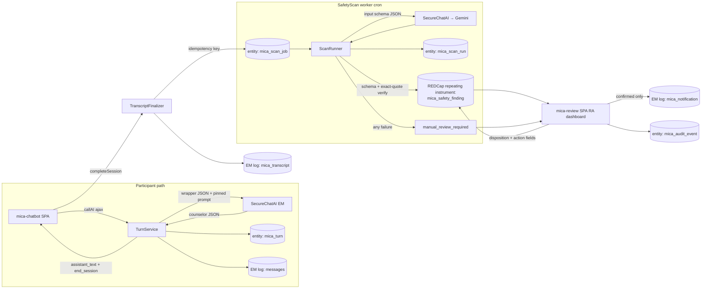

# Architecture

Everything lives in the `proj_mica` EM. New server code goes under `classes/`
as focused services; the participant chat stays a no-auth page; the RA
dashboard is a new authenticated page. All LLM traffic continues to flow
through the SecureChatAI EM.

## 1. Vendored handoff artifacts

New module directory `handoff/` containing the frozen artifacts copied verbatim:

- `MICA_Prompt_R01_v2_postsession_safety.txt`
- `MICA_counselor_output_schema_v2.json`, `MICA_wrapper_schema_v2.json`
- `MICA_SafetyScan_PostSession_prompt.txt` (v1.1)
- `MICA_safetyscan_postsession_{input,model_output}_schema.json`
- `MICA_safetyscan_{review_workflow,notification_policy}_schema.json`
- `MICA_safetyscan_notification_policy.default.json`
- `manifest.json` — the artifact→SHA-256 map from the handoff manifest

`ArtifactRegistry` service loads each artifact once per request, computes
SHA-256, and **refuses to operate if any hash differs from the manifest**
(fail-closed; the error surfaces in the chatbot as the standard technical
fallback and in logs as a config error). The verified hashes are what get
written to the `mica_turn` / `mica_scan_run` entity rows — the logged hash is always the
hash of what was actually used, not a constant.

Rationale: the handoff pins prompts by hash and the lifecycle policy requires
recording prompt/schema hashes per turn/scan. Project-settings textareas can't
provide that integrity, so the per-session prompt textareas are retired for R01
(counselor behavior is fully defined by the pinned prompt + SESSION_CONTEXT).

## 2. Counselor turn pipeline (Workstream A)

`TurnService::handleTurn($record, $patientMessage)`:

1. **Session state** — `SessionStateService` resolves (see §3):
   `session_type`, `location`, current MI `phase`, `minutes_remaining`,
   `alcohol_summary`, `readiness/confidence`, `prior_goal(+status)` (booster),
   `research_approved_resources`, bounded `message_history`.
2. **Build request** — assemble the wrapper object and validate it against
   `wrapper_schema_v2` with `opis/json-schema` (draft 2020-12). A wrapper
   validation failure is a *our-bug* guard: log + technical fallback, never a
   silent trim. Messages sent to the model:
   - `system`: pinned v2 prompt text
   - `system`: `SESSION_CONTEXT:\n<wrapper JSON minus patient_message/history>`
   - history turns as `user`/`assistant` messages
   - `user`: the latest participant message
3. **Call model** — `SecureChatAI::callAI($alias, $params)` with:
   `json_schema` = counselor output schema (strict), `max_tokens: 1200`,
   `reasoning_effort: medium`, **no temperature** (handoff: omit unless the
   deployment documents it). Alias from project setting
   `counselor-model-alias` (dev: `gpt-5-4`; later: the pinned Luna deployment).
4. **Validate response** — in order:
   1. JSON parse (reject non-JSON / truncation)
   2. schema validation (`additionalProperties:false` rejects any
      `safety_flag`/`escalation` resurgence by construction)
   3. app gates:
      - **one-question**: `substr_count(assistant_text, '?') ≤ 1`
      - **word limit**: whitespace-tokenized word count ≤ 140 when
        `response_strategy == 'summary'`, else ≤ 90
      - **phase transition**: `next_phase` legal from current phase per a
        configurable transition matrix (proposed default in `02-data-model.md`;
        needs study-team sign-off — open question #5)
5. **Failure policy** (technical reliability path, explicitly not a clinical
   alert): first violation → one corrective retry on the same model (violation
   fed back as a system nudge); second → single attempt on
   `counselor-fallback-alias` (`gpt-5-4`); still bad / timeout / refusal /
   5xx → return the pre-approved static technical-difficulty message from a
   project setting. **A failed turn never releases model text** and is logged
   with its failure taxonomy.
6. **Persist + respond** — accepted turn appends participant + assistant
   messages to the EM-log message store (as today; these rows are the
   transcript source of truth), records the turn in the `mica_turn` Entity
   table (hashes,
   resolved model, params, latency, tokens, gates, `phase → next_phase`,
   `end_session`; **no message text**), advances stored phase, and returns
   **only** `assistant_text` + `end_session` to the browser. `next_phase` /
   `response_strategy` stay server-side (state + audit), per the handoff.

### Frontend changes (mica-chatbot)

- Render `assistant_text` (server already returns only that as `content` —
  keep the wire shape, so UI change is minimal).
- When `end_session: true`: disable input, show the wrap-up prompt, and drive
  the existing PostSession/`completeSession` flow.
- Time display: session countdown from `session_minutes` (new bootstrap
  field) so participants see the same clock the server enforces.
- Remove any UI/state referencing per-session pilot contexts (sessions 2–7).

## 3. R01 session engine (replaces pilot engine)

Target structure = PID 257 as rebuilt (see `docs/project-structure/`): MICA
runs at **Day 1 (ED)** (`mica_ed_session` instrument, arms 2 & 3) and
**Month 3** (`mica_booster_session`, arms 2 & 3).

- `session_type`: `baseline` when the active window is the Day-1 event and no
  finalized baseline transcript exists; `booster` when inside the Month-3
  window. Windows computed from enrollment/randomization dates + configurable
  window settings (not the pilot's `consent_date + 14n` arithmetic).
- `location`: recorded on the session instrument by staff (`ed` default for
  baseline; `remote_followup` default for booster) — field, not inference.
- `phase`: last accepted `next_phase` for the active session (from
  `mica_turn`), `engage` at session start.
- `minutes_remaining`: `session_minutes` setting (default 15, schema max)
  minus elapsed since first turn of the active session, clamped to [0, 15].
- `alcohol_summary`: mapped from screening/DDQ fields (mapping table in
  `02-data-model.md`, needs data-dictionary confirmation).
- `prior_goal` / `prior_goal_status`: written at baseline close, read by
  booster.
- `research_approved_resources`: project setting (one per line) — the prompt
  forbids inventing resources, so an empty list means "offer none".
- Bounded history: last `history-max-messages` (default 20) accepted messages,
  each hard-truncated to the schema's 4000-char ceiling.
- Login: **superseded 2026-08-17** — the custom OTP flow is *retired*, not kept.
  Participants enter via a record-bound, expiring participant link (SMS-preferred
  in the ED) plus REDCap-native **Survey Login** scoped to the two MICA chat
  surveys. Open question #7 is answered (participant's own device at Day 1). See
  [`08-auth-discovery.md`](08-auth-discovery.md) for the design and
  [`09-pid-257-structure-audit.md`](09-pid-257-structure-audit.md) for the
  as-built constraints (no `ui_hosting_instrument`, no DOB field).
- Session hosts: `mica_ed_session` (Day 1, arms 2 & 3) and
  `mica_booster_session` (Month 3, arms 2 & 3) — one survey per window, so the
  active window is carried by the link's own event rather than inferred.
- Legacy pilot code paths (sessions 2–7, `month3_fu`, `posttest`, `des_mica`,
  `consent_date` arithmetic, `two_factor_*`) are removed after tagging the pilot
  release (Stage 0). Note none of those fields exist in PID 257, and the R01
  post-session measure is `postsession`.

## 4. Transcript finalization (A→B bridge)

On `completeSession` (participant action or staff close):

1. Collect the session's accepted messages from the EM log in order.
   `message_id = "L<log_id>"` (immutable, unique), `sequence` = 1..n,
   `speaker_role` participant|mica, ISO-8601 timestamps.
2. Build the SafetyScan **input-schema v1** payload; validate it; serialize
   canonically (fixed key order, `JSON_UNESCAPED_UNICODE|JSON_UNESCAPED_SLASHES`);
   SHA-256.
3. Append the immutable `mica_transcript` row to the **EM log store**
   (payload + hash + counts; payload chunked at 60 KB — see
   `02-data-model.md §1.2`), referenced everywhere as `T<log_id>`. Keep
   writing the human-readable `raw_chat_logs` + completion status to the
   REDCap session form as today, plus `mica_transcript_hash` and
   `mica_transcript_ref`.
4. Enqueue a `mica_scan_job` Entity row with `idempotency_key =
   sha256(project_id|record|session_type|transcript_sha256)` under a UNIQUE
   index (added by the module's post-`buildSchema` migration) — duplicate
   `session_closed` events are no-ops (spec: no duplicate findings under
   retries).
5. Admin-only transcript correction (rare) inserts a **new** transcript
   log row (`version + 1`, `supersedes_log_id` pointing back) + a new scan
   job; originals are never mutated (EM-log rows have no update path).

## 5. SafetyScan pipeline (Workstream B)

`ScanRunner` (EM cron, every minute, small batch):

1. **Claim** a due job atomically (`UPDATE ... SET status='scanning',
   claimed_by=:token WHERE status='queued' AND next_attempt_at<=NOW() LIMIT 1`).
2. **Call** `SecureChatAI::callAI(safetyscan-model-alias, …)` — pinned v1.1
   prompt as system, transcript JSON as user content, `json_schema` = model
   output schema. Dev alias `gemini-2.5-flash`; production `gemini-3.5-flash`
   once provisioned.
3. **Validate**: JSON parse → output schema → **exact-quote verification**:
   every `evidence[].exact_quote` must be an exact substring of the cited
   `message_id`'s content and `speaker_role` must match. Any mismatch fails
   the scan with `citation_mismatch` (handoff: mismatch ⇒ manual review, and
   released findings must be 100% traceable).
4. **Success**: store the immutable `mica_scan_run` Entity row (verbatim
   `model_output_json` = the authoritative findings record) and create one
   repeating `mica_safety_finding` instance per finding via `saveData`
   (app-generated `finding_id` UUIDs, `saveData` errors inspected), job →
   `ready_for_review`, notify assigned RA per policy.
5. **Failure taxonomy** `timeout | refusal | invalid_json | schema_invalid |
   citation_mismatch | content_filter | service_error`: transient classes get
   bounded retries with backoff (default 3); terminal or exhausted →
   `manual_review_required` + a `scan_failure` placeholder finding instance
   (so the RA disposition lives on the instrument) + RA notification + audit
   event. **Never** a
   negative screen; `scan_result: no_supported_concern` is itself a reviewable
   record (sessions with zero findings remain visible in history).
6. p95 scan latency observed at ~16 s — a 1-minute cron with batch 3–5 clears
   study-scale volume comfortably; jobs are per-session, post-session, so no
   participant-facing latency.

## 6. RA dashboard (`mica-review/` SPA)

Second Vite+React app, mounted from a **new authenticated EM page**
(`pages/review.php`, project sidebar link; not in `no-auth-pages`). All data
via module AJAX actions that (a) require project context + REDCap auth,
(b) enforce module-level roles, (c) write `mica_audit_event` on every read of
participant-level data and every mutation.

Roles via project settings (user lists): `ra_reviewer`, `pi_protocol_lead`,
`sysadmin` (config only — cannot change clinical review decisions),
`auditor` (read-only, deidentified aggregates). Care-team members are
notification recipients only — no dashboard access.

Views (per dashboard spec):

- **Queue** — default sort critical → high → moderate → quality → oldest
  unreviewed; filters (date, urgency, category, status, reviewer, session
  type, notification state, model version); `manual_review_required` items
  surfaced at top alongside criticals.
- **Session review** — readable conversation view (participant/MICA styling,
  sequence numbers, message IDs on demand), highlighted evidence spans,
  finding cards (category, urgency, confidence, summary, recommended
  actions), jump-to-evidence, full-transcript search, raw model JSON behind a
  "technical" toggle.
- **Disposition** — confirm / dismiss / needs-second-review; optional
  corrected category/urgency; **required rationale**; all written by the
  module to the review fields of the finding instance (REDCap data log =
  change history); notes never edit transcript or model output; optimistic
  locking via `review_lock_version` (stale submission ⇒ 409 + reload prompt).
- **Actions** — only for confirmed findings, only protocol-approved actions
  for that concern/urgency; template preview with minimum-necessary content;
  explicit send confirmation; delivery/acknowledgment tracking. The UI never
  displays "alerted" from a model recommendation alone.
- **History & audit** — all sessions (including zero-finding ones), decisions,
  actions, hashes/versions; permission-controlled export.
- **Settings** — notification policy editor validated against the policy
  schema; launch-readiness card (§8).

## 7. Notifications & digests

`NotificationService`, email-first (`REDCap::email`), channel abstraction so
SMS (existing Twilio system settings) can be added later if approved.

- Policy = JSON validated against `notification_policy_schema`; ships as the
  handoff default (RA-ready notifications on; pre-review notifications
  **off**; `critical_acknowledgment_minutes: null`).
- RA "findings ready" notification on `ready_for_review` /
  `manual_review_required`.
- Confirmed-finding actions render protocol-approved templates with
  minimum-necessary info + dashboard deep link; every delivery recorded as a
  `mica_notification` EM-log row; failures visible and retriable, never silently marked
  complete.
- If pre-review notifications are ever enabled by protocol, message text is
  forced to include the "Unverified automated SafetyScan finding pending human
  review" label from the policy schema; it never changes finding state.
- Digest crons (daily/weekly) render aggregate counts (scanned, awaiting
  review, overdue, confirmed/dismissed rates, scanner failures, quality
  trends) with a dashboard link; no participant-level content in email.
- Acknowledgment tracking: overdue monitor cron flags unacknowledged critical
  actions once `critical_acknowledgment_minutes` is configured.

## 8. Launch-readiness validator

`LaunchReadiness::evaluate()` returns pass/fail per gate:

- `critical_acknowledgment_minutes` configured (non-null) — **the handoff's
  deliberate launch blocker**
- notification recipients + RA role assignments present
- artifact hashes verified against manifest
- counselor + scan model aliases resolve in SecureChatAI
- pre-review notification policy schema-valid

Enforcement: a `production-mode` project setting cannot be enabled while any
gate fails, and when the REDCap project is in Production status with
`production-mode` off or gates failing, **session start is refused** with a
staff-facing explanation. In Development status the chatbot runs with a
visible "launch gates unmet — development only" banner. (Scanning itself is
never blocked — the gate stops enrollment-facing operation, not review
infrastructure.)

## 9. SecureChatAI extensions (separate, backward-compatible PR)

1. **Config-driven capabilities**: add per-model sub-settings
   `supports-json-schema` and `supports-reasoning-effort` checkboxes; the
   hardcoded `$schemaModels` / reasoning lists become fallbacks. Today
   `reasoning_effort` is stripped for `gpt-5-4` (list is `['o1','o3-mini','gpt-5']`)
   and Gemini can never receive `json_schema` — both blockers for this phase.
2. **Gemini structured output**: when `json_schema` present, set
   `generation_config.response_mime_type = "application/json"` +
   `response_schema` (translated subset), and surface schema-parse output the
   same way the OpenAI path does (`structured_output`).
3. **Gemini safety settings + block detection**: make `safety_settings`
   configurable per model registry entry (current hardcoded
   `BLOCK_LOW_AND_ABOVE` on one category), and normalize
   `promptFeedback.blockReason` / empty-candidate responses into an explicit
   `content_filter` error so ScanRunner can classify it. SafetyScan transcripts
   *contain self-harm content by design*; default Vertex filters can block
   exactly the scans that matter most (open question #12 for the approved
   filter policy).
4. **New registry aliases** (config, no code): the pinned Azure Luna
   deployment and Vertex `gemini-3.5-flash` when Stanford IT provisions them.

Nothing MICA-side hardcodes a model name; swapping to Luna is a settings
change + qualification run, per the lifecycle policy.

## 10. Privacy posture (unchanged principles, enforced in new places)

- Model calls carry pseudonymous IDs only (`session_id_pseudonymous` =
  salted hash of project+record+session, stored on the transcript log row).
- The `mica_turn`, `mica_scan_run`, and audit Entity rows carry **no
  transcript text**; message text lives in the EM log store (message rows +
  the `mica_transcript` payload) and — evidence quotes and summaries only —
  on the `mica_safety_finding` instances (REDCap project data; approved
  study environment = REDCap DB).
- Digests/notifications: aggregate or minimum-necessary content only.
- Every dashboard access and mutation is audit-logged with actor + role.
